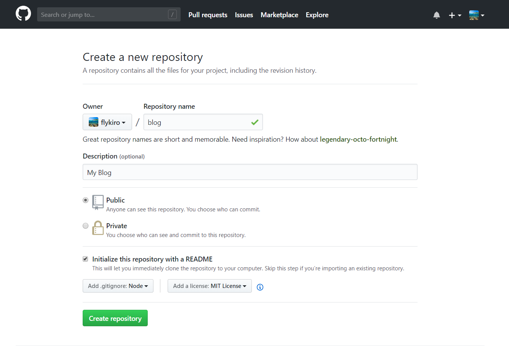
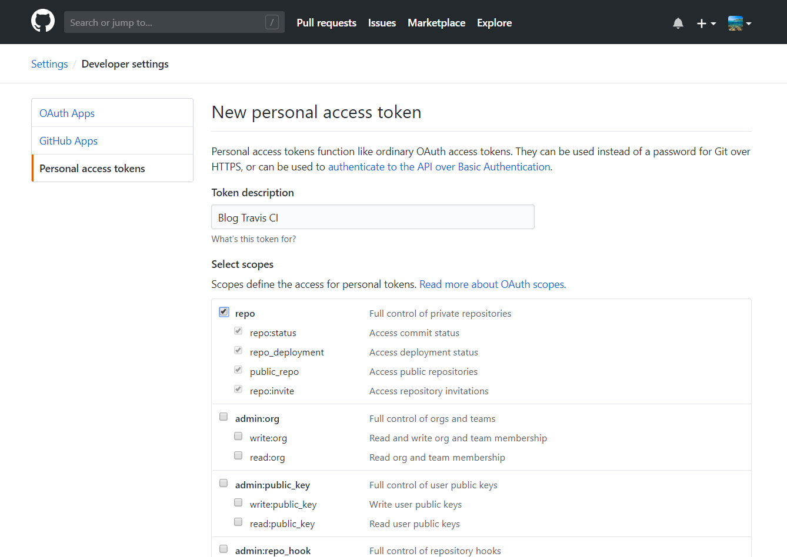
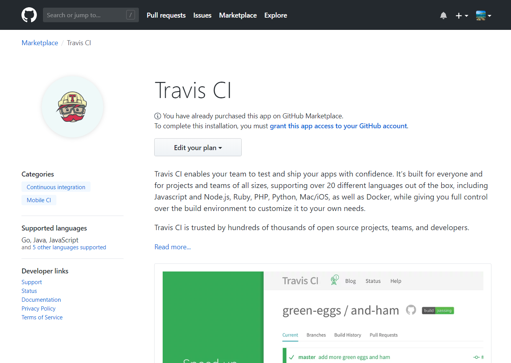

# Hello World!

这是使用vuepress的第一篇博客。

## 总结下使用vuepress生成的博客如何使用Travis CI集成到GitHub Pages。

1. 创建新仓库


2. 生成GitHub私钥，注意保持，后面会用到


3. 在GitHub安装Travis CI支持 [链接地址](https://github.com/marketplace/travis-ci)


4. 配置Travis CI启用相关项目


5. 克隆仓库到本地
```bash
cd ~
git clone git@github.com:flykiro/blog.git my-blog
```

6. 对项目进行初始化
```bash
cd my-blog
yarn init # or use npm

# 安装 vuepress
yarn add vuepress -D

# 创建测试文章
mkdir docs
cd docs
echo "# Test My Blog!" > README.md
```

7. 编写docs/.vuepress/config.js配置文件，例如：
```javascript
module.exports = {
  base: '/blog/', // baseURL为你仓库的名称
  title: 'Kiro\'s Blog',
  description: 'Kiro\'s Blog',
  serviceWorker: true,
  themeConfig: {
    nav: [
      { text: 'Home', link: '/' }
    ]
  }
}
```

8. 编写.travis.yml文件，例如：
```yaml
language: node_js
# 指定 NODEJS 版本
node_js:
  - "8"

# 安装 vuepress
install:
  - npm install vuepress --save-dev

# install后执行的脚本
script:
  - npm run build

# 脚本执行后 使用git提交到github pages
after_script:
  - cd ./docs/.vuepress/dist
  - git init
  - git config user.name "kiro"
  - git config user.email "flykiro@gmail.com"
  - git add -A
  - git commit -m "deploy"
  - git push -f "https://${GH_TOKEN}@github.com/flykiro/blog.git" master:gh-pages
```

9. 提交并推送更改
```bash
cd ~/my-blog
git add .
git commit -m "First Commit"
git push
```

10. 使用Github账户登录Travis CI网站，注意域名是[travis-ci.com](https://travis-ci.com)


11. 在Travis CI项目下配置私钥的环境变量


12. 重新部署


13. [查看结果](https://flykiro.github.io/blog/)

